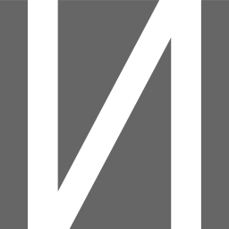

 

# icon

The Independent Contractor Order Negotioation Protocol (ICON) for assisting the organisation of work documentation for independent contractors

## about

In order to assist in the focusing of work process and improve auditability while engaging in contract production, ICON is a set of guidelines and software tools for helping Contractors perform work better without sacrificing autonomy to managers.

- logging and automatically tagging messages relevant to work with use of short text tags and chat platform threading
- integrating issues tracking boards and automating attaching relevant data from message logs.
- defining stages of an order and ensuring the protocol is followed in educational materials as well as other possible methods of reminders and prompts.

By lowering the cost of organising the labor of contractors, the idea is to reduce the amount of management labor and make independent contractors more competitive with employees. There is also philosophy around greater independence of action leading to greater accountability and more measured and effective risk taking.

### the logo

Not often seen used in typography in latin script using countries, but the 'backwards N' is the slavic symbol for the phoneme like the english 'ee', rather than the english first person pronoun (I, me). It happens to also be the letter that sneakily looks closest to S, which had its tail chopped from the greek to cyrillic, and grown to the latin form. If you include that it is also the Sig rune in many norse runic scripts, which is different to the rounded S of Sowelu, symbol of Sun and Victory. Sig is the same principle of victory, but illustrates it with rising up, being forced to retreat, and then finding a way to rise again.

Not to get too heavily into the sigilography but it rolls a lot of things in by these associations that are relevant, the process of defining a target, the inevitable refinement towards what will be delivered, and then the final production to rollout, it encodes the protocol visually as well.

The dark grey color is to evoke the color of graphite pencil marks, and the white gaps signify the flow of resources from agreement until transfer of title.
